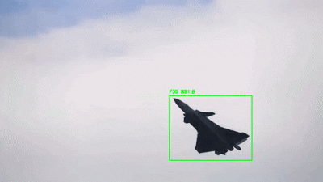

<h1>Model: bplane-small</h1>

Technical documentation for a lightweight military aircraft detection and classification model,
designed for high-dynamic aerial scenarios and real-world operational footage.

<h3>Operational Demonstration</h3>

The demonstration above highlights the model’s behavior under rapid viewpoint changes,
high-G maneuvers, and partial silhouette deformation. Temporal stabilization and class voting
are applied to maintain consistent identity assignment across consecutive frames.

## Project Overview
BPlane-Small-v1 is a computer vision framework built on the YOLO architecture, optimized for the
detection and classification of military aircraft in unconstrained environments. The model is
designed to operate on real surveillance-style imagery, where scale variation, motion blur,
and non-ideal viewing angles are common.

The system supports fine-grained airframe classification across multiple fighter and support
platforms, while retaining a general *Military Aircraft* fallback class for ambiguous or
previously unseen silhouettes.

---

## Technical Specifications
- **Model Architecture:** YOLO (Small variant)
- **Primary Accuracy Metric:** mAP@50 = 0.80
- **Operational Resolution:** 1024×1024 (dynamic inference supported)
- **Deployment Formats:** PyTorch (`.pt`), ONNX (`.onnx`)

---

## Validation Predictions
The following samples illustrate raw validation outputs produced directly by the YOLO
training pipeline. Predictions include confidence scores and bounding boxes without
post-processing or manual filtering.

---

## Ground Truth Label Visualization
The images below show annotated validation samples with ground truth bounding boxes.
They provide insight into dataset quality, annotation consistency, and scale variation
across different aircraft classes.

  
  

---

## Dataset Composition & Label Statistics
The following figure summarizes class frequency and bounding box distributions generated
automatically during training. It highlights both class imbalance and object scale diversity,
which directly influence classification stability.

> Notably, fighter-class aircraft exhibit significant scale and aspect-ratio variance,
> reinforcing the need for robust multi-scale feature extraction.

---

## Statistical Analysis & Performance
Overall performance indicates strong reliability for transport and utility aircraft, as well
as clear differentiation between most air superiority fighters. Misclassifications tend to
occur under extreme maneuvering or when aircraft silhouettes deviate significantly from
canonical viewpoints.

### Normalized Confusion Matrix

---

### F-16 Detection Case Study
Among all classes, the F-16 exhibits the highest variability in detection confidence. This
behavior is primarily driven by rapid silhouette transitions during high-G turns and
aggressive roll angles.

- **Classification Accuracy:** 61%
- **Background Misclassification:** 13%  
  *(Typically during extreme banking or high-alpha maneuvers)*
- **Generalization Loss:** 8%  
  *(Fallback to general “Aircraft” class under low-visibility conditions)*
- **Cross-Model Confusion:**  
  Minor overlap with F-18 (6%) and Rafale (4%)

---

## Training Progress & Metric Stabilization
Training metrics demonstrate stable convergence across localization, classification, and
objectness losses. Precision–recall behavior indicates consistent generalization on the
validation set.

### Training Results and Loss Curves

### Precision–Recall (PR) Curve

---

## Target Classification List
The dataset is composed exclusively of military aviation assets and includes the following
target categories:

- **Air Superiority & Multi-Role:** F-15, F-16, F-18, F-35, J-20, EF2000, Rafale
- **Close Air Support:** A-10
- **Airlift & Utility:** C-130, C-2
- **General Category:** Military Aircraft  
  *(Fallback class for unspecified or ambiguous platforms)*

---

## Future Development Objectives
- **Dataset Augmentation:**  
  Expanding F-16 samples from ventral and dorsal viewpoints to reduce background-induced
  misclassification.
- **Architecture Scaling:**  
  Evaluating medium-sized YOLO variants to improve feature separation in dense or cluttered
  scenes.
- **Signature Optimization:**  
  Refining silhouette discrimination for aircraft with similar delta-wing and blended-body
  configurations.
