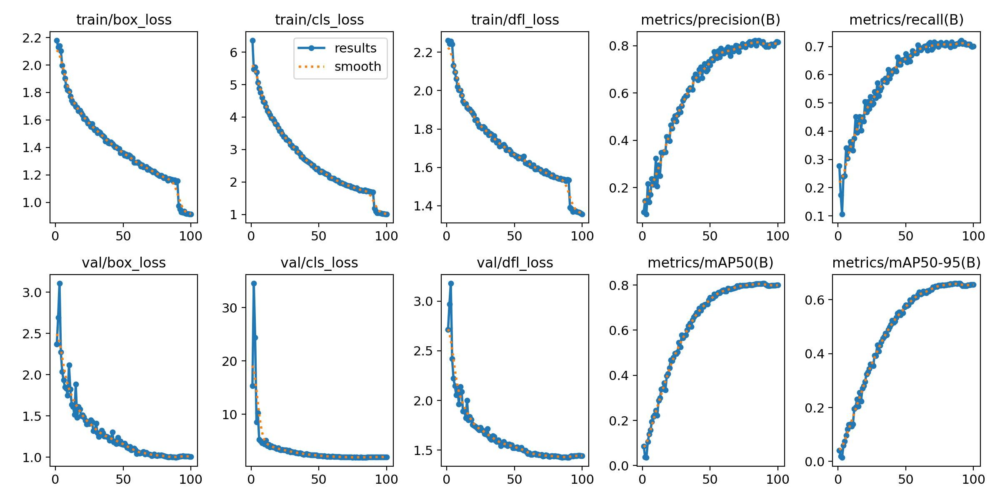
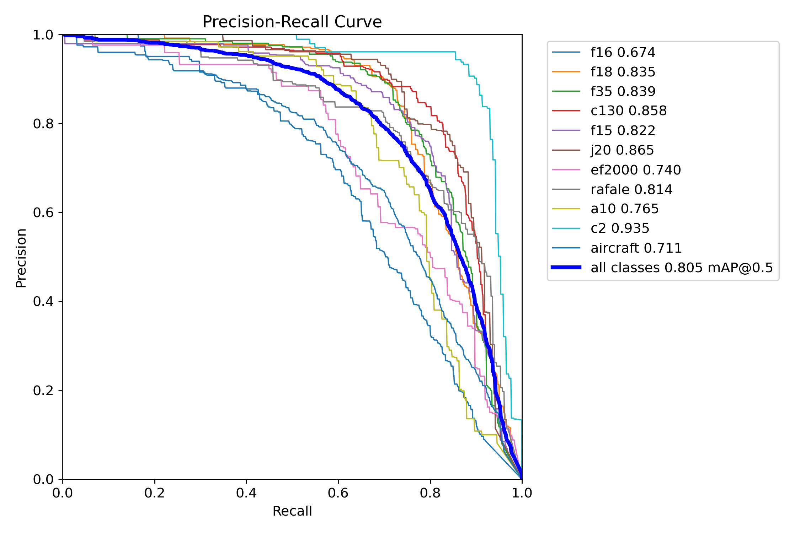

<h1>Model: bplane-small</h1>

Technical Documentation for Military Aircraft Detection and Classification

<h3>Operational Demonstration</h3>

The following sequence illustrates the model's performance in high-dynamic environments and complex aerial maneuvers.

<video src="assets/demo_video.mp4" width="100%"></video>

### Project Overview
BPlane-Small-v1 is a computer vision framework built upon the YOLO architecture, specifically optimized for the identification and tracking of military aviation assets. The model distinguishes between ten specific airframe categories and utilizes a general classification fallback for unidentified military silhouettes.

### Technical Specifications
- **Model Architecture:** YOLO (Small variant)
- **Primary Accuracy Metric (mAP@50):** 0.80
- **Operational Resolution:** 1024x1024 (Dynamic inference supported)
- **Deployment Formats:** PyTorch (.pt), ONNX (.onnx) runtime

### Statistical Analysis & Performance
The model demonstrates high reliability in detecting transport and utility aircraft, as well as distinct air superiority fighters like the F-15 and F-35. Detailed performance metrics are provided below through the normalized confusion matrix.

#### Normalized Confusion Matrix

#### F-16 Detection Case Study
Technical evaluation indicates that the F-16 class possesses the highest variation in detection confidence due to its unique silhouette transitions during high-G maneuvers.
- **Classification Accuracy:** 61%
- **Background Misclassification:** 13% (Occurs during extreme banking/high-alpha angles)
- **Generalization Loss:** 8% (Reversion to general 'Aircraft' class in low-visibility conditions)
- **Cross-Model Confusion:** Minor interference with F-18 (6%) and Rafale (4%) signatures.

### Training Progress & Metric Stabilization
The following charts detail the convergence of loss functions and the stabilization of precision-recall metrics across the training duration.

#### Training Results and Loss Curves

#### Precision-Recall (PR) Curve

### Target Classification List
The dataset is exclusively comprised of military aviation assets:
- **Air Superiority & Multi-Role:** F-15, F-16, F-18, F-35, J-20, EF2000, Rafale
- **Close Air Support:** A-10
- **Airlift & Utility:** C-130, C-2
- **General Category:** Military Aircraft (Fallback for unspecified models)

###Future Development Objectives
**​Dataset Augmentation:** Expanding F-16 training samples from ventral and dorsal perspectives to reduce background misclassification.
​**Architecture Scaling:** Evaluation of Medium-sized YOLO variants for enhanced feature extraction in dense environments.
**​Signature Optimization:** Refining silhouette discrimination between similar delta-wing configurations.
